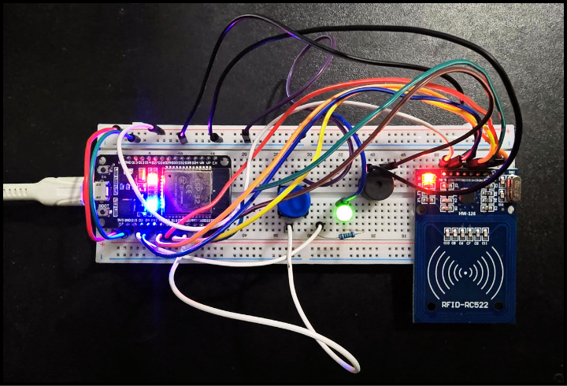

# ESP32 Handheld RFID Reader

Firmware for a handheld RFID reader based on the ESP32 microcontroller and MFRC522 module. The project leverages FreeRTOS for concurrent task management and transmits data over Bluetooth using a structured JSON protocol.



## ✨ Features

* **Conditional Polling:** RFID scanning is active only when a push button is engaged.
* **Wireless Data Transmission:** Utilizes Bluetooth Serial (SPP) to send data to a connected host.
* **Structured Data Protocol:** Employs a JSON-based protocol for clear and extensible data communication.
* **Multi-Tasking Architecture:** Built on FreeRTOS to handle hardware polling, user interface feedback, and communication tasks concurrently without blocking.
* **User Feedback:** Provides both audible (buzzer) and visual (LED) feedback for successful reads and connection status.

## ⚙️ Hardware Specifications

* 1 x ESP32 Development Board
* 1 x MFRC522 RFID Reader Module (13.56MHz)
* 1 x Push Button, Momentary
* 1 x Passive Buzzer
* 1 x 5mm LED (any color)
* 1 x 220-330 Ohm Resistor
* Breadboard and Jumper Wires

## 🔌 Wiring Diagram

| Component | ESP32 Pin | 
| :--- | :--- |
| **MFRC522 SDA** | `GPIO 5` | 
| **MFRC522 SCK** | `GPIO 18` | 
| **MFRC522 MOSI** | `GPIO 23` | 
| **MFRC522 MISO** | `GPIO 19` | 
| **MFRC522 RST** | `GPIO 4` | 
| **Buzzer (+)** | `GPIO 22` | 
| **Button** | `GPIO 21` | 
| **LED (+)** | `GPIO 2` | 
| **VCC (3.3V)** | `3V3` | 
| **GND** | `GND` | 

*Note: The Button is configured with an internal pull-up resistor. The LED's anode connects to the GPIO pin via the current-limiting resistor.*

## 💻 Software & Deployment

This project is configured for the **PlatformIO** ecosystem within Visual Studio Code.

1. **Environment:** Ensure the [PlatformIO IDE extension](https://platformio.org/platformio-ide) is installed in VS Code.
2. **Dependencies:** The required libraries (`MFRC522`, `ArduinoJson`) are listed in the `platformio.ini` file and will be installed automatically by PlatformIO upon the first build.
3. **Build & Upload:**
   * Clone the repository.
   * Open the project folder in VS Code.
   * Use the PlatformIO toolbar to **Upload** the firmware to the ESP32.

## 📖 Operational Guide

1. **Power On:** Apply power to the ESP32 via USB. The status LED will blink, indicating it is awaiting a Bluetooth connection.
2. **Bluetooth Pairing:** From a host device (PC, smartphone), scan for Bluetooth devices and pair with `PatroRFID-Reader`. Upon successful connection, the LED will cease blinking.
3. **Data Acquisition:**
   * Open a Bluetooth Serial terminal application on the host device.
   * Press and hold the push button. The status LED will illuminate, indicating the RFID reader is active.
   * Present a compatible RFID tag to the MFRC522 antenna.
   * A successful read triggers an audible beep, and the corresponding JSON data payload is transmitted to the serial terminal.

## 📶 Communication Protocol

Data is serialized into a JSON object for transmission. This ensures data integrity and facilitates parsing on the client-side.

### Example Payload
```json
{
  "deviceId": "PatroRFID-Reader",
  "uid": "A1:B2:C3:D4",
  "cardType": "MIFARE 1K"
}
```

## 📄 License

This project is licensed under the MIT License.  
Feel free to use it in your projects -- just make sure to credit **Luis Felipe Patrocinio** ([GitHub](https://github.com/luisfpatrocinio)).  
See the [LICENSE](./LICENSE) file for full details.