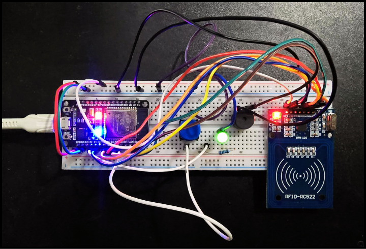

🌎 [English](README.md) | 🇧🇷 [Português](README.pt-br.md)

# Smart UHF Reader (Smart Stock Project)

Firmware for a versatile handheld RFID UHF reader and writer based on the ESP32 and the R200 module. This device acts as the data collection endpoint for the **Smart Stock** project — an innovative inventory control system created under the **EmbarcaTech Program**.

The project features a robust, multi-tasking architecture using FreeRTOS, advanced UHF radio manipulation, and a comprehensive JSON-based command protocol over **Bluetooth Low Energy (BLE)** to communicate seamlessly with mobile applications.



## ✨ Key Features & Engineering Solutions

- **Dual Read/Write Modes:** Seamlessly switch between reading existing tags and writing new data through the BLE app interface.
- **Continuous Mode ("Machine Gun"):** The trigger button can be held down to read or write multiple tags in batches, ideal for fast shelf scanning.
- **Session Memory (Anti-Spam Filter):** To avoid "Capture Blindness" (where the antenna monopolizes the signal of the closest tag), the ESP32 temporarily memorizes tags already processed in the current cycle, physically ignoring them to read tags at the bottom of boxes.
- **"Factory Fingerprint" Usage (96-bit TID):** Instead of using the rewritable EPC as a UID, the system extracts the hardware TID (Immutable) from the tag by sending complex `0x39` extraction commands. This guarantees absolute data integrity in the Smart Stock database, making item duplication impossible.
- **Anti Cross-Talk Shield:** In high-density environments, the firmware cross-references the EPC information with the TID response to ensure it is not merging responses from neighboring tags (avoiding "Frankenstein" packets).
- **Packet Cleaning (Sanity Check):** Strict UART buffer protection against corrupted packets and radio noise, preventing the sending of garbage data or "Unknown Products" to the App.
- **Tag Restoration (Zero Padding):** Reusability of inventory tags by sending empty string commands (`""`), which the ESP32 translates into null padding (hexadecimal zeros) to cleanly reset the chip's memory.
- **Multi-Tasking Architecture:** Built on FreeRTOS to concurrently handle RFID operations, BLE communication, and UI feedback without blocking the radio's serial communication.

## ⚙️ Hardware Specifications

- 1 x ESP32 Development Board
- 1 x R200 UHF RFID Reader Module (UART)
- 1 x Push Button, Momentary
- 1 x Active Buzzer
- 1 x 5mm LED (any color)
- 1 x 220-330 Ohm Resistor
- Breadboard and Jumper Wires

## 🔌 Wiring Diagram

| Component         | ESP32 Pin | Note                             |
| :---------------- | :-------- | :------------------------------- |
| **R200 TX**       | `GPIO 16` | Connect to ESP32 RX              |
| **R200 RX**       | `GPIO 17` | Connect to ESP32 TX              |
| **Buzzer (+)**    | `GPIO 22` | Active Buzzer                    |
| **Button**        | `GPIO 21` | Configured with internal pull-up |
| **LED (+)**       | `GPIO 2`  | With current-limiting resistor   |
| **VCC (3.3V/5V)** | `VCC`     | Check R200 input requirements    |
| **GND**           | `GND`     | Common Ground                    |

## 💻 Software & Deployment

This project is configured for the **PlatformIO** ecosystem within Visual Studio Code.

1.  **Environment:** Ensure the [PlatformIO IDE extension](https://platformio.org/platformio-ide) is installed in VS Code.
2.  **Dependencies:** The required libraries (e.g., `ArduinoJson`) are listed in the `platformio.ini` file and will be installed automatically by PlatformIO upon the first build.
3.  **Build & Upload:**
    - Clone the repository.
    - Open the project folder in VS Code.
    - Connect your ESP32 board via USB.
    - Use the PlatformIO toolbar to **Upload** the firmware.

## 📖 Operational Guide

1.  **Power On:** Apply power to the ESP32. The status LED will blink slowly, indicating it is advertising and ready for a BLE connection.
2.  **Connect via BLE:** Use the Smart Stock mobile application to connect to the device named `PatroRFID-Reader`. Once connected, the LED will stop blinking.

### Reading a Tag (Default)

- Press and hold the push button. The reader will continuously scan for tags.
- A successful read triggers a beep, and a `readResult` JSON payload (containing the immutable TID and decoded data) is sent to the app.

### Writing to a Tag

1.  **Enter Write Mode:** The app sends the `changeMode` command (`"write"`).
2.  **Send Data:** The app sends the `writeData` command containing the SKU/String to write.
3.  **Present Tag:** Press the button and hold the pistol near the tags. The device discovers the hardware TID, overwrites the EPC, and manages the session memory to quickly jump to the next unwritten tag.
4.  **Receive Confirmation:** The device sends a `writeResult` JSON payload confirming the success and echoing the unique TID.

## 📶 Communication Protocol (BLE JSON)

Communication is handled via a single BLE characteristic that accepts JSON commands and sends JSON responses via notifications.

### Client → Device (Commands)

#### 1. Change Operational Mode

```json
{
  "type": "changeMode",
  "content": "write"
}
```

_(Use `"stop"` to return to read mode)_

#### 2. Send Data for Writing

```json
{
  "type": "writeData",
  "content": "SENYAR13021"
}
```

#### 3. Restore Tag (Clear Memory)

```json
{
  "type": "writeData",
  "content": ""
}
```

#### 4. Toggle Sound

```json
{
  "type": "toggleSound",
  "content": "off"
}
```

### Device → Client (Responses & Data)

#### 1. RFID Read Result

Sent when a tag is successfully read and validated against cross-talk.

```json
{
  "type": "readResult",
  "content": {
    "status": "ok",
    "uid": "E28069152000501D1A2B3C4D",
    "rssi": 194,
    "data": "SENYAR13021"
  }
}
```

#### 2. RFID Write Result

Sent after a successful write cycle.

```json
{
  "type": "writeResult",
  "content": {
    "status": "ok",
    "uid": "E28069152000501D1A2B3C4D",
    "data": "SENYAR13021",
    "message": "Gravado com Sucesso!"
  }
}
```

## 🏗️ Code Structure

The firmware is organized into a clean, modular architecture:

- `main.cpp`: The main entry point, initialization, and FreeRTOS task creation.
- `config.h`: Centralized definitions for hardware pins and UART constants.
- `R200.cpp / .h`: Low-level driver for the R200 UHF module (UART byte routing, TID extraction, padding).
- `rtos_comm.h`: Declares shared global variables and FreeRTOS primitives.
- `ble_comm.cpp / .h`: Manages BLE services and characteristic callbacks.
- `rfid_handler.cpp / .h`: The core logic for continuous reading, writing, and session memory management.
- `ui_handler.cpp / .h`: Non-blocking LED and Buzzer tasks.

## 📄 License

This project is licensed under the MIT License.
See the [LICENSE](https://github.com/luisfpatrocinio/esp32-PatroRFID/blob/main/LICENSE) file for full details.

## 👨‍💻 Authors

This project was created and maintained by:

- **[Luis Felipe Patrocinio](https://github.com/luisfpatrocinio/)**
- **[João Pedro Mendes de Oliveira](https://github.com/Jpedro23)**

Developed for the **Smart Stock** project under the **EmbarcaTech Program**.
